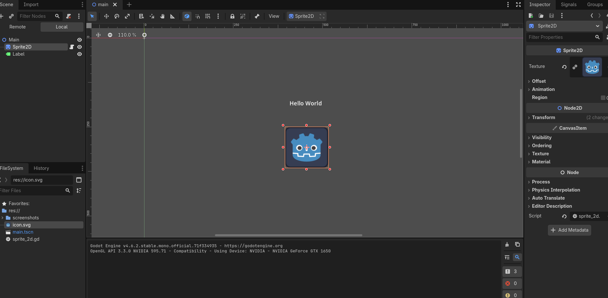
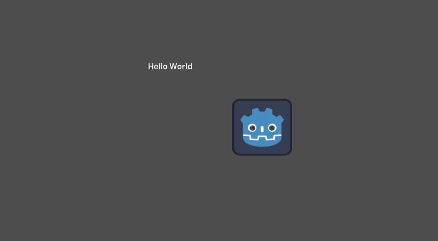
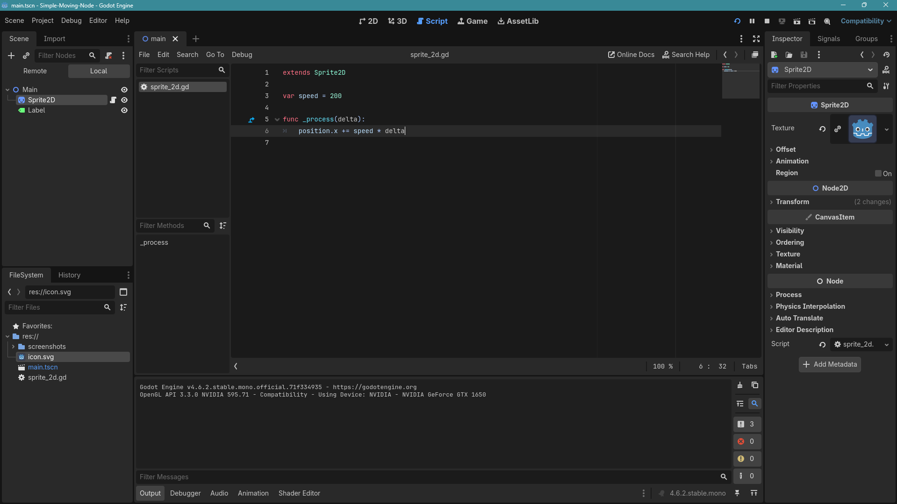
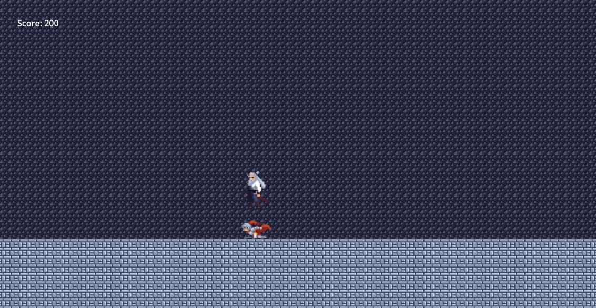
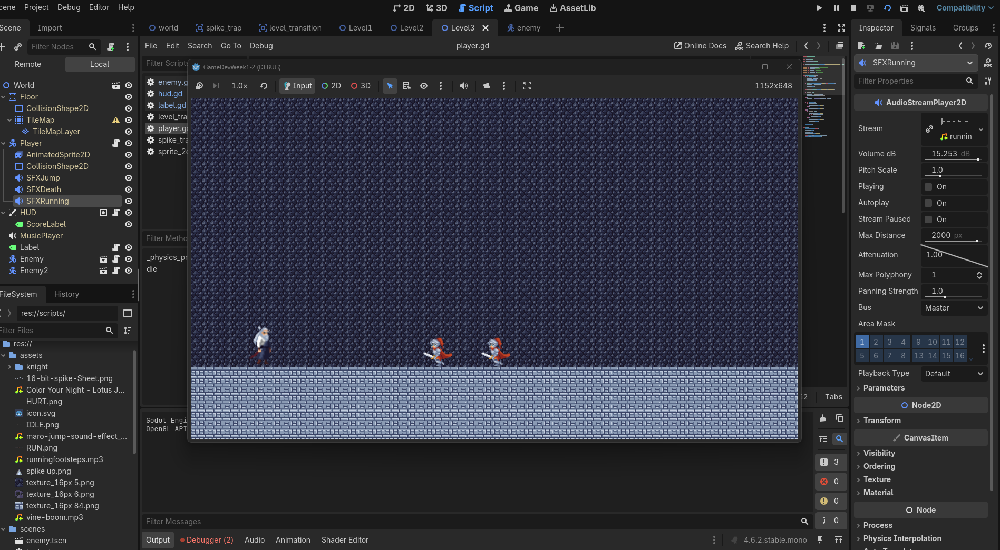
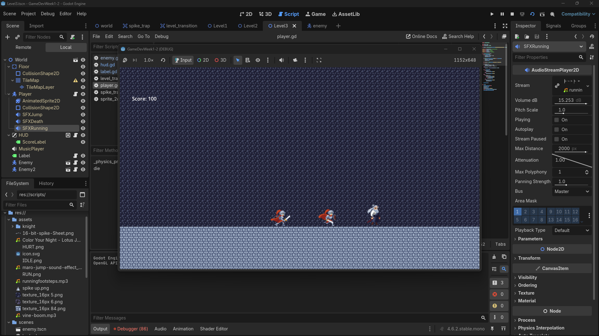
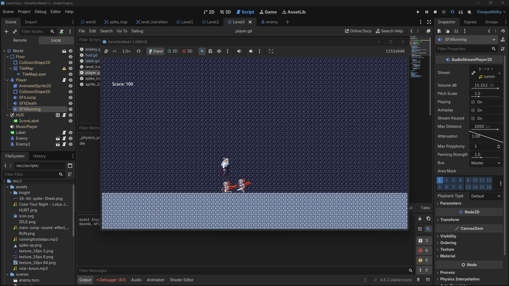

# Week 1 - Simple Scene with a Moving Node

## Activity Overview
This project demonstrates a basic 2D scene in Godot Engine featuring a "Hello World" label and a Sprite2D node that moves across the screen using a GDScript.

## Screenshots
 
*Figure 1: Editor setup with Label and Sprite2D nodes.*

 
*Figure 2: The scene running with the moving icon.*

 
*Figure 3: The script for the scenes.*

# Week 2 - Activity 1 Gameplay Mechanics!

## Activity Overview
Gameplay Mechanics
Subtopics: Handling input (keyboard/gamepad), physics bodies (rigid/kinematic), collision detection. Basics of player controllers (movement, jumping).

## Screenshots
 
*Figure 4: The scene for player moving.*

 
*Figure 5: The scene for player jumping.*

 
*Figure 6: The second script for the scenes.*

# Week 2: Activity 2 - Level Design & Mechanics

## Gameplay Overview
This project features two distinct levels of a side-scrolling runner, demonstrating level flow, difficulty scaling, and hazard implementation.

## Screenshots
 
*Figure 7: The Level 1.*

 
 
*Figure 8: The Level 2 and fade away for the Level 2 Text.*

 
 
*Figure 9 & 10: Tilemaps and Traps.*

# Week 3: Activities 1 & 2 - UI/UX, Audio, and Enemy AI

## Gameplay Overview
This update introduces a dynamic user interface for score tracking, immersive audio systems for actions and background music, and intelligent enemy entities utilizing Finite State Machines for patrolling and chasing mechanics. 

## Screenshots
 
*Figure 11: The CanvasLayer Score HUD tracking player points.*

 
 
*Figure 12: The Enemy transitioning from Patrolling to Chasing the player.*

 
*Figure 13: The Player stomping the enemy's Headbox to trigger the death animation and gain points.*